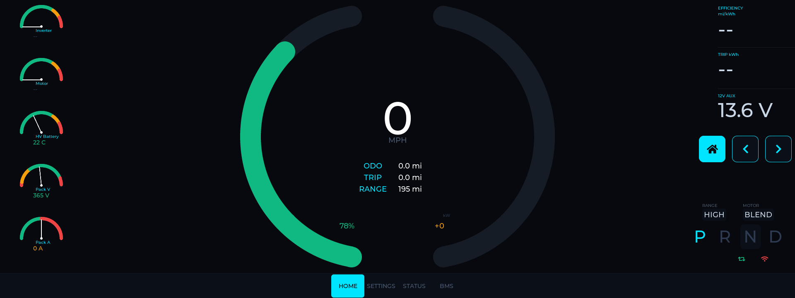
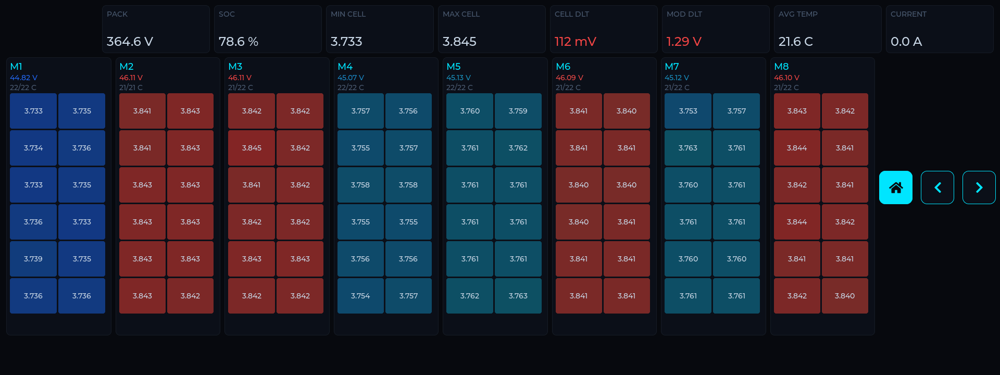
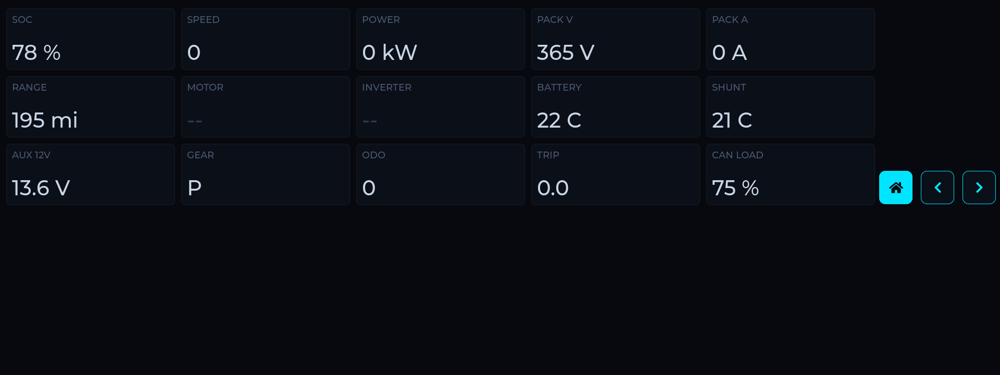

# EVJ55 Dashboard

An LVGL instrument cluster for an EV conversion — in this case, a 1976 Toyota FJ55
Land Cruiser ("EVJ55") running a Lexus **LS600HL** transmission, a
**ZombieVerter / openinverter** VCU, and **BMW i3** battery. It renders speed,
power, state-of-charge, temperatures, gear (PRND) and battery/BMS detail on a
Waveshare 12.3" DSI touch panel, driven live from the vehicle CAN bus.

> This is a personal project for one specific vehicle, shared as-is. Fork-friendly; **not**
> maintained as a general-purpose product. If it's useful to you, take it and run applying all due credit etc.
>
> This code was substantially developed by Claude Code since I have retired from my long embedded firmware career.  There was extensive pulling of Claude's leash and supervision from my embedded firmware perspective.   I also wanted to learn more about this AI thing and this was a good non-mission-critical app to do that with.

## Screenshots

| Home | BMS | VCU |
|------|-----| ----- |
|  |  |  |

## Which branch do I want?

This repo carries two lineages of the same dashboard. **Pick your branch by hardware:**

| Branch | Compute | Display | Status |
|--------|---------|---------|--------|
| **`main`** (here) | **Linux** — Raspberry Pi 5 → Radxa CM3 (RK3566), fbdev | Waveshare **12.3" DSI-TOUCH-A** (720×1920 native → 1920×720 landscape, 4-lane) | **Active** |
| `esp32p4` | **ESP32-P4** (Waveshare ESP32-P4-Nano), ESP-IDF/FreeRTOS | DSI panel — best suited to **2-lane** glass; also ran on the **M5Stack Tab5** | **Frozen** — preserved, not developed |

The project *started* on the ESP32-P4. The 12.3" panel needs 4 DSI lanes, which
pushed the live build to a Linux SBC (and, ultimately, a Radxa CM3 chosen for
suspend-to-RAM instant-on). The ESP32-P4 line is frozen on the `esp32p4` branch
for anyone targeting a 2-lane DSI display or the Tab5 — that branch has the board
wiring, pin map and OTA flashing. A read-only snapshot also lives under
[`esp32p4/`](esp32p4/) on this branch. Older feature branches (`tab5`, `waveshare`,
`gvret`, `esp-idf-5.5-upgrade`) are historical.

## What's on this branch

- **Native Linux** LVGL 9.x app over **fbdev** (`/dev/fb0`) — no RTOS, no ESP-IDF.
  fbdev (not DRM) so LVGL can do the software rotation the portrait-mounted panel needs.
- **Target:** Raspberry Pi 5 today; **Radxa CM3 (RK3566) on a CM4 IO board** as the
  production compute (paired with a custom vehicle-interface HAT).
- **Live data:** vehicle CAN via **SocketCAN** (`can0`) — ZombieVerter VCU frames
  (`zombie_can_map.txt` / `.json`); BMW i3 BMS pulled over HTTP.
- **HTTP API** on `:8080` — JSON data + PNG screenshot endpoints.
- Touch via **evdev** (GT911 auto-detected).

## Why fbdev (not DRM)

LVGL's DRM driver renders `LV_DISPLAY_RENDER_MODE_DIRECT` into the physical
framebuffer, which cannot do software rotation. The panel is native 720×1920
portrait and the UI is 1920×720 landscape, so we need rotation — LVGL's **fbdev**
driver rotates in software in its flush. Hence `/dev/fb0` + `lv_display_set_rotation`.
(`libdrm` is only a build-time include dependency for LVGL's unused DRM driver; the
app links no DRM at runtime.)

## Build & run (native, on the target or a Pi)

```sh
sudo apt install -y cmake build-essential libdrm-dev pkg-config
cmake -B build -DCMAKE_BUILD_TYPE=Release
cmake --build build -j

sudo systemctl stop lightdm      # release the panel (dev box only)
./build/dashboard                # /dev/fb0, auto-detected touch, 270° rotation
# ./build/dashboard /dev/fb0 /dev/input/event5   # explicit device args
# LV_ROTATE=90 ./build/dashboard # override rotation (0/90/180/270)
```

LVGL is taken from `managed_components/lvgl__lvgl` if present, else fetched
(v9.5.0). Config is `lv_conf.h` (32-bit color, CLIB malloc, fbdev+evdev, the
montserrat fonts the UI uses).

## Cross-compile for the Radxa CM3 (aarch64)

Build the deployable CM3 binary on an x86-64 dev box instead of on-target:

```sh
sudo apt install -y g++-aarch64-linux-gnu
sudo dpkg --add-architecture arm64
sudo apt install -y libdrm-dev:arm64          # arm64 pkgs come from ports.ubuntu.com

cmake -B build-arm64 -DCMAKE_TOOLCHAIN_FILE=cmake/toolchain-aarch64.cmake \
      -DCMAKE_BUILD_TYPE=Release
cmake --build build-arm64 -j                  # -> build-arm64/dashboard (ARM aarch64)
```

See [`cmake/toolchain-aarch64.cmake`](cmake/toolchain-aarch64.cmake) for the
multiarch sysroot notes (and the M-A:same pocket-matching gotcha).

## Repo layout

| Path | What |
|------|------|
| `src/` | Shared UI (`dashboard_ui.cpp`) + CAN parser + Linux app entry (`main_linux`, `stubs`, `bms_http`, `http_api`) |
| `include/` | Shared headers |
| `compat/` | ESP-IDF API shims for the Linux build (`esp_err.h`, `esp_timer.h`, …) |
| `cm3/` | Radxa CM3 provisioning — device-tree overlays, systemd units, `target/` filesystem mirror |
| `deploy/` | Appliance boot setup (systemd service, Plymouth splash) |
| `cmake/` | Cross-compile toolchain (aarch64) |
| `docs/` | Datasheets, schematics |
| `esp32p4/` | **Frozen** ESP32-P4 line — a read-only snapshot; not built from `main` (see the `esp32p4` branch) |

## Architecture

One shared UI, two platform backends — the reason both lineages can coexist:

- **Shared UI:** [`src/dashboard_ui.cpp`](src/dashboard_ui.cpp) and the CAN parser
  (`src/can_parser.cpp`) — identical on both platforms.
- **Linux backend:** `src/main_linux.cpp` + [`compat/`](compat/) — fbdev display,
  evdev touch, SocketCAN, HTTP API. The ESP-IDF APIs the shared code expects are
  provided by thin stubs in `compat/` (`esp_err.h`, `esp_timer.h`, …), so the
  shared tree compiles unmodified.
- **ESP32-P4 backend:** the ESP-IDF `app_main()` in
  [`esp32p4/src/main.cpp`](esp32p4/src/main.cpp) (`pio run`; see the `esp32p4`
  branch and its README for wiring/flashing).

## Related

Part of the broader EVJ55 conversion — a ZombieVerter VCU, a BMW i3 CSC BMS, and
an M5Dial JLR shifter, each in their own repos. The Radxa CM3 vehicle-interface
HAT (power supervision, CAN, EPB, MagneRide, ignition-sense) is designed separately.

## License

[BSD-3-Clause](LICENSE) — Copyright © 2026 Herb Peyerl.

Permissive: use it, fork it, ship it — keep the copyright and license notice, and
don't use the author's name to promote derived products. Provided **as-is, with no
warranty** — it's a hobby dashboard for a moving vehicle; run it at your own risk.
